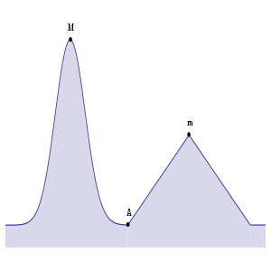
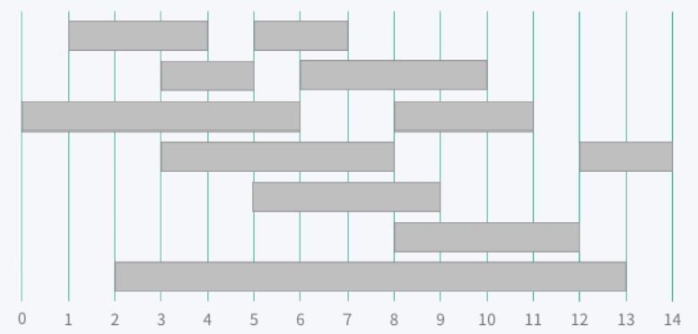
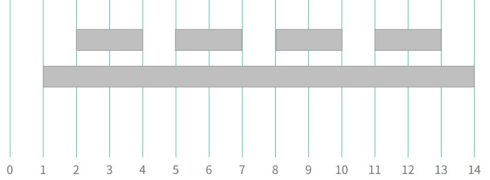

# 10. 탐욕법

## 도입

가장 직관적인 알고리즘 설계 패러다임 중 하나.

원하는 답을 재귀 호출과 똑같이 여러 개의 조각으로 쪼개고, 각 단계마다 답의 한 부분을 만들어 간다는 점에서는

완전 탐색이나 동적 계획법과 다를 것이 없다.

그러나 모든 선택지를 고려해보고 그 중 전체의 답이 가장 좋은 것을 찾는 두 방법과는 달리 지금 당장 좋은 방법만을 선택하는 방법이다.

외판원 문제를 예로 들었을 때 DP는 도착 할 수 있는 도시들을 하나 하나 검사하여 남은 도시들을 모두 순회하는데 필요한 거리의 합을 최소화 하는 답을 찾는다. 

그리디는 당장 다음 도시까지의 거리만을 최소화 한다.

종만북 내용은 아니고 내가 가장 직관적으로 이해했던 자료는 이거다.

 



A 지점에서 좌우로 적절히 이동하여 최대 높이에 다다르려 할 때

m은 local maximum이다. 그 근처 지역에 한해서는 가장 이득이지만, 전체 중에서는 최적해가 아닐 수 있는 것.

M은 global maximum이다. 전체에서 최적해를 의미. 당연히 global maximum 또한 local maximum입니다.

그러나 전체 상황을 모르는 우리로서는 어딘가 도착해도 그게 글로벌인지, 아니면 단지 로컬한 최적해인지 판단하기도 어렵다.

A 위치에서 , m으로 가는 길은 경사가 45도보다 커보이지만 반면에 M으로 가는 길은 곡선인데 당장은 기울기가 0에 가까워서, **당장 보기엔 m 쪽으로 가는 길이 이득으로 보여서 m으로 가버리고 만다.**

이와 같이 실제로 그리디 알고리즘은 많은 경우 최적해를 찾지 못한다.

### 

### 탐욕법을 적용 할 수 있는 경우

1. 탐욕법을 사용해도 항상 최적해를 구할 수 있는 문제를 만난 경우, 탐욕법은 동적 계획법보다 수행 시간이 훨씬 빠르기 때문에 유용하다.
2. 시간이나 공간적 제약으로 인해 다른 방법으로 최적해를 찾기 너무 어렵다면 최적해 대신 적당히 괜찮은 답\(근사해\)를 찾는 것으로 타협 할 수 있다. 탐욕법은 이럴 때 최적의 답보다는 좋은 답을 구하는 용도로 유용하게 쓰인다.

플밍 대회에서는 주로 첫 번째 용도로만 쓰인다.

대회에서는 근사해를 찾는 문제는 거의 출제 안되고 근사해를 구하는 문제가 주어졌다 해도 조합 탐색이나 메타휴리스틱 알고리즘이 더 좋은 답을 주는 경우가 많기 때문.

한 문제를 탐욕적으로 해결하는 방법은 한 가지만 있는 것이 아닌 경우도 많은데 이 중 어느 방법을 선택해야 최적해를 구할 수 있을 지를 알아내기가 어렵기 때문에 대회에서 발목 많이 잡힌다.

실제로 최적해를 얻을 수 있는 접근이 직관적이지 않은 경우도 많기 때문에 실수에 더 유의해야한다.

그러니 그리디 문제를 풀 때는 알고리즘의 정당성을 증명하는 과정을 뺴먹지 않고 연습해야한다.

### 

## 예제: 회의실 예약

그리디가 유용하게 사용되는 문제 중 유명한 예로 활동 선택 문제\(active selection problem\)가 있다.

회사에 회의실이 하나밖에 없을 때 팀이 각각 회의하고 싶은 시간을 아래와 같이 제출했다고 할 때, 최대 몇개나 선택할 수 있을까?



#### 무식하게 풀 수 있을까?

이 문제에는 답이 여러 가지 있을 수 있다. 서로 겹치지 않는 회의들의 집합은 모두 이 문제의 답이다.

이 때 최적해는 크기가 가장 큰 부분 집합이다.

모든 부분 집합을 하나 하나 만들어 보며 그중 회의들이 겹치지않는 답들을 걸러내고 그중 가장 큰 부분집합을 찾아내는 방법으로 무식하게 풀 수 있다.

그러나 집합의 크기가 n일 때 부분 집합의 수는 2^n이기 때문에 n이 30만 되어도 시간 안에 문제를 풀기는 힘들다.

#### 탐욕적 알고리즘 구상

길이가 짧은 회의부터 순회하며 앞의 것들과 겹치지 않는 것들을 추가하는 방법도 탐욕법이 될 수 있으며 그럴듯해 보인다. 그러나 아래의 예를 보면 틀린 구상이다.



이 문제를 해결하는 탐욕적인 방법은 길이와 상관없이 가장 먼저 끝나는 회의부터 선택하는 것이다.

1. 목록 S에 남은 회의 중 가장 일찍 끝나는 회의 Smin 을 선택한다.
2. Smin과 겹치는 회의를 S에서 모두 지운다.
3. S가 빌 때까지 반복한다.

그리디의 정당성 증명은 많은 경우 일정한 패턴을 가진다.

이 증명 패턴은 그리디가 항상 최적해를 찾아낼 수 있다는 두 가지의 속성을 증명함으로써 보인다.


### 탐욕적 선택 속성

탐욕적 선택 속성\(greedy choice property\)이란 DP처럼 답의 모든 부분을 고려하지 않고 탐욕적으로만 선택하더라도 최적해를 구할 수 있다는 것이다.

어떤 알고리즘에서 이 속성이 성립할 경우, 우리가 각 단계에서 탐욕적인 선택을 해서 '손해'를 볼 일 이없다는 것을 알 수 있다.

```text
가장 종료 시간이 빠른 회의(Smin)를 포함하는 최적해가 반드시 존재한다.
```

S의 최적해 중에 Smin을 포함하지 않는 답이 있다면

이 목록에서 첫 번째로 개최되는 회의를 지우고 Smin을 대신 추가해서 새로운 목록을 만든다. Smin은 가장 일찍 끝나는 회의이기 때문에 지워진 회의는 Smin 보다 일찍 끝날 수 없다.

따라서 두번째 회의와 Smin이 겹치는 일은 없으며 새로 만든 목록도 최적해 중 하나가 된다.

따라서 항상 Smin을 포함하는 최적해는 존재한다. 이와 같은 증명은 우리가 가장 일찍 끝나는 회의를 선택해서 최적해를 얻는 것이 불가능한 경우는 없음을 보여준다.

### 최적 부분 구조

최적 부분 구조\(optimal substructure\)는 동적 계획법 처럼 부분 문제의 최적해에서 전체 문제의 최적해를 만들 수 있음을 보여야하는 것이다.

탐욕적으로 선택속성을 갖고있다고 해서 항상 최적해를 준다고 보장하는 것은 아니다. 매순간 최적의 선택만으로 전체 문제의 최적해를 얻을 수 있어야한다.

이 속성은 대개 매우 자명해서 따로 증명할 필요는 없다.

### 구현

BOJ : [1931번 회의실배정](https://www.acmicpc.net/problem/1931)

* 종만북 코드

```cpp
int n;
int begin[100], end[100];
int schedule(){
    vector<pair<int,int>> order;
    for(int i=0;i<n;i++)
        order.push_back(make_pair(end[i],begin[i]));
    sort(order.begin(),order,end());
    int earliest= 0,selectd = 0;
    for(int i=0;i<order.size();++i){
        int meetingBegin = order[i].second, mettingEnd = order[i].first;
        if(earliest <= meetingBegin){
            earliest = meetingEnd;
            ++selected;
        }
    }
    return selcted;
}
```

* 내 코드

  진짜 사람 생각이 거기서 거기구나.. 옛날에 백준에서 풀었던 코드 올림.\

```cpp
#include<stdio.h>
#include<utility>
#include<vector>
#include<algorithm>
using namespace std;
bool compare(pair<int,int> a, pair<int,int> b){
  if(a.second==b.second)
  return a.first<b.first;
return a.second<b.second;
}
int main() {
  vector<pair<int,int>> times;
  pair<int,int> temp=make_pair(-1, -1);
    int n,open,close,ans=0;
  vector<pair<int,int>>::iterator itr;
  scanf("%d",&n);
  for(int i=1;i<=n;i++)
  { 
    scanf("%d %d",&open,&close);
    times.push_back(make_pair(open,close));
  }
 sort(times.begin(),times.end(),compare);
  for(itr= times.begin();itr!=times.end();++itr)
  {
    if((*itr).first>=temp.second)
    {
      temp=*itr;
      ans++;
    }
  }
  printf("%d",ans);
    return 0;
}
```

### 동적 계획법으로 푼다면??

사실 모든 단계를 고려하는 동적 계획법의 답이 틀릴일은 없다.

그러나 그리디를 쓰는 이유는 그리디의 한 단계로 끝낼 수 있는 이 문제의 경우 동적 계획법으로 풀 경우 필요한 메모리나 시간이 과도하게 크기 때문이다.  


