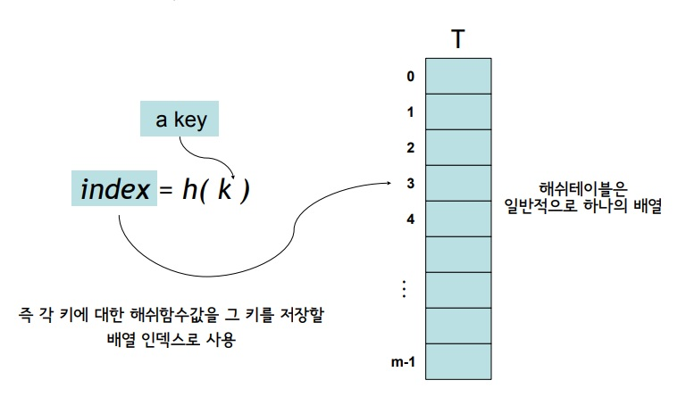
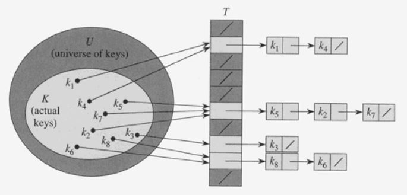

# Hashing

## Hash Table

해쉬 테이블은 dynamic set을 구현하는 효과적인 방법의 하나 

* 적절한 가정하에서 평균 탐색, 삽입, 삭제시간 O\(1\) 
* 보통 최악의 경우 Θ\(n\)

해쉬 함수\(hash function\) h를 사용하여 키 k를 T\[h\(k\)\]에 저장

*  h : U → {0,1,...,m-1}, 여기서 m은 테이블의 크기, U는 모든 가능한 키들의 집합 
* 키 k가 h\(k\)로 해슁되었다고 말함.

### 해쉬 함수의 예

* 모든 키들을 자연수라고 가정. 
* 어떤 데이터든지 자연수로 해석하는 것이 가능. 문자열의 예 : 'CLRS'
  * 문자열 ASCII 코드 : C=67, L=76, R=82, S=83. 
  * 문자열 CLRS는 \(67·128³\)+\(76·128²\)+\(82·128¹\)+\(83·128º\)=141,764,947 
* 해쉬 함수의 간단한 예 :
  * h\(k\) = k % m, 즉 key를 하나의 자연수로 해석한 후 테이블의 크기 m으로 나눈 나머지 
  * 항상 0~m-1 사이의 정수가 됨 

## 충돌\(collision\)

* 두 개 이상의 키가 동일한 위치로 해되는 경우
* 즉, 서로 다른 두 키 k1과 k2에 대해서 h\(k1\)=h\(k2\)인 상황
* 일반적으로 \|U\|&gt;&gt;m이므로 항상 발생 가능 \(즉 단사함수가 아님\)
* 만약 \|K\|&gt;m라면 당연히 발생, 여기서 K는 실제로 저장된 키들의 집합 
* 충돌이 발생할 경우 대처 방법이 필요 대표적인 두 가지 충돌 해결 방법
* chaining과 open addressing

### Chaining에 의한 충돌 해결

동일한 장소로 해싱된 모든 키들을 하나의 연결리스트\(Linked List\) 로 저장하는 방법

#### 키의 삽입\(Insertion\) 

* 키 k를 리스트 T\[h\(k\)\]의 맨 앞에 삽입: 시간복잡도 O\(1\) 
* 중복된 키가 들어올 수 있고 중복 저장이 허용되지 않는다면 삽입시 리스트를 검색해야 함. 따라서 시간복잡도는 리스트의 길이에 비례 

#### 키의 검색\(Search\) 

* 리스트 T\[h\(k\)\]에서 순차검색
* 시간복잡도는 키가 저장된 리스트의 길이에 비례. 

#### 키의 삭제\(Deletion\) 

* 리스트 T\[h\(k\)\]로 부터 키를 검색 후 삭제
* 일단 키를 검색해서 찾은 후에는 O\(1\)시간에 삭제 가능

최악의 경우는 모든 키가 하나의 슬롯으로 해싱되는 경우인데   
이 때 길이가 n인 하나의 연결리스트가 만들어진다.

* 따라서 최악의 경우 탐색시간은 Θ\(n\) + 해쉬 함수 계산시간 

평균 시간 복잡도는 키들이 여러 슬롯에 얼마나 잘 분배되느냐에 의해서 결정된다.

#### SUHA \(Simple Uniform Hashing Assumption\)

각각의 키가 모든 슬롯들에 균등한 확률로\(eually likely\) 독립적으로 \(independently\) 해된다는 가정 

* 성능분석을 위해서 주로 하는 가정임
* hash함수는 deterministic하므로 현실에서는 불가능 

Load factor α = n/m: 

* n: 테이블에 저장될 키의 개수.
* m: 해쉬테이블의 크기, 즉 연결리스트의 개수
* 각 슬롯에 저장된 키의 평균 개수

연결리스트 T\[j\]의 길이를 nj라고 하면 E\[nj\] = α

만약 n=O\(m\)이면 평균검색시간은 O\(1\)

