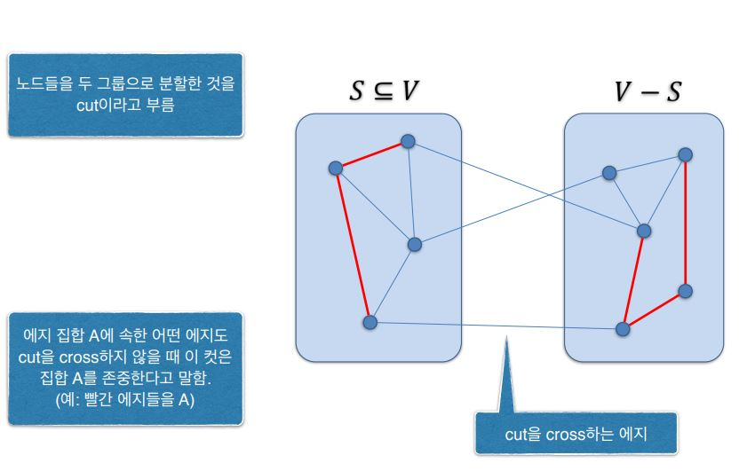
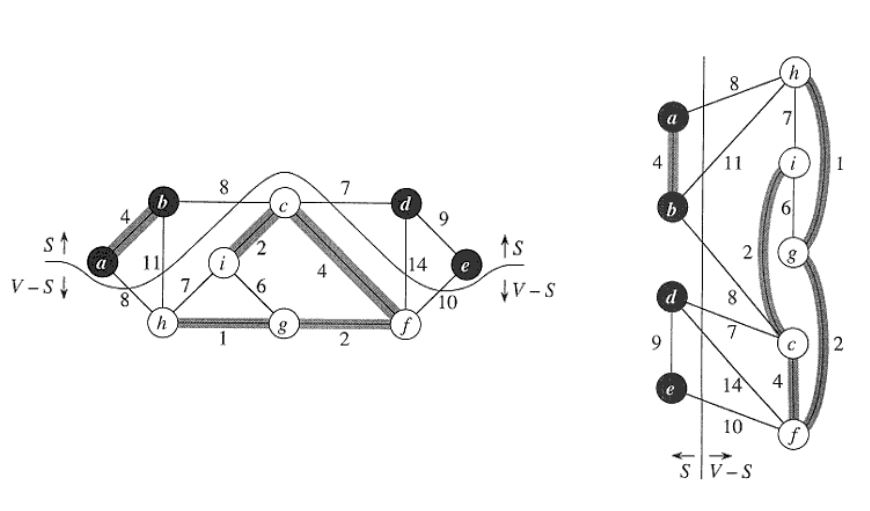
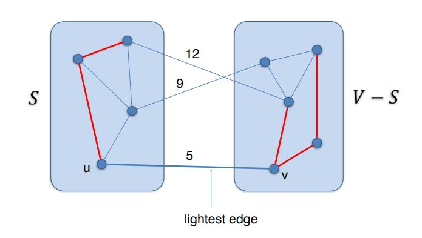

# Minimum Spanning Tree

최소 신장트리는 다양한 분야에서 응용되는 가장 기본적인 그래프 문제이다.

네트워크\(통신, 도로, 가스배관 등\) 디자인 등등.

연결되어 있으면서 비용이 최소화 된다는 것은 모든 종류의 네트워크에서 요구되어지는 것이기 때문.

## 최소비용 신장 트리\(MST\)의 개념

* 무방향 가중치 그래프 G=\(V,E\) \(가중치는 양수\)
* 각 에지 \(u,v\)∈E 에 대해서 가중치 w\(u,v\) 
* 문제 : 다음과 같은 조건을 만족하는 에지들의 부분집합 T⊆E를 찾아라.  1. T에 속한 에지들에 의해 그래프의 모든 정점들이 서로 연결된다.  2. 가중치의 합 $$\sum_{(u,v)\in T} w(u,v)$$이 최소가 된다.
* 싸이클이 없는 연결된\(connected\) 무방향 그래프를 트리라고 부른다. 
* MST 문제의 답은 항상 트리가 된다. -&gt; 노드가 n개인 트리는 항상 n-1개의 에지를 가짐

## Generic MST 알고리즘

크루스칼 알고리즘과 프림 알고리즘의 공통된 구조.

어떤 MST의 부분집합 A에 대해서 A∪{\(u,v\)}도 역시 어떤 MST의 부분집합이 될 경우 **에지 \(u,v\)는 A에 대해서 안전하다\(safe\)**고 한다.

###  알고리즘

1. 처음에는 A=∅이다.
2. 집합 A에 대해서 **안전한 에지**를 하나 찾은 후 이것을 A에 더한다. 
3. 에지의 개수가 n-1개가 될 때까지 2번을 반복한다.

```text
Generic-MST(G, w){
    A<-ø
    while A does not form a spanning tree
        do find edge (u,v) that is safe for A   
            A<-A U {(u,v)}
    return A
}
```

### 안전한 에지 찾기

* 그래프의 정점들을 두 개의 집합 S와 V-S로 분할한 것을 **컷\(cut\) \(S,V-S\)**라 고 부른다.
* 에지 \(u,v\)에 대해서 u∈S이고 v∈V-S일 때 에지 \(u,v\)는 컷 \(S,V-S\)를 **cross**한다고 말한다.
* 에지들의 부분집합 A에 속한 어떤 에지고 컷 \(S,V-S\)를 cross하지 않을 때 컷 \(S,V-S\)는 A를 **존중한다\(respect\)**고 말한다.






A가 어떤 MST의 부분집합이고, \(S,V-S\)는 A를 존중하는 컷이라고 하자.   
이 컷을 cross하는 에지들 중 가장 가중치가 작은 에지 \(u,v\)는 A에 대해서 안전하다.



