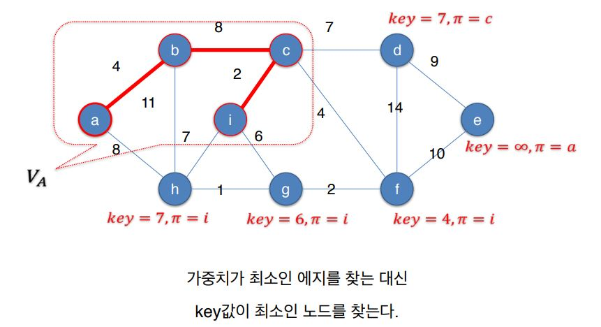

# Prim Algorithm

## Prim Algorithm

* 임의의 노드를 출발노드로 선택 
* 출발 노드를 포함하는 트리를 점점 키워 감
* 매 단계에서 이미 트리에 포함된 노드와 포함되지 않은 노드를 연결하는 에지들 중 가장 가중치가 작은 에지를 선택

### 동작 원리

### 

### 가중치가 최소인 에지 찾기

* Va : 이미 트리에 포함된 노드들 
* Va 에 아직 속하지 않은 각 노드 v에 대해서 다음과 같은 값을 유지 - key\(v\) : 이미 Va에 속한 노드와 자신을 연결하는 에지들 중 가중치가 최소인 에지 \(u,v\)의 가중치 - π\(v\) : 그 에지 \(u,v\)의 끝점 u

###  O\(n²\) 알고리즘

### 우선 순위 큐를 사용한 알고리즘 

* 최소 우선순위 큐를 사용 - V~Va에 속한 노드들을 저장 - Extract-Min : key값이 최소인 노드를 삭제하고 반환

### 시간복잡도

* 이진 힙\(binary heap\)을 사용하여 우선순위 큐를 구현한 경우 
* while loop:  - n번의 Extract-Min 연산: O\(nlogn\)  - m번의 Decrease-Key 연산: O\(mlogn\) 
* 따라서 시간복잡도: O\(nlogn + mlogn\) = O\(mlogn\) - m&gt;=n-1이다.
* 우선순위 큐를 사용하지 않고 단순하게 구현할 경우: O\(n²\) 
* Fibonacci 힙을 사용하여 O\(m+nlogn\)에 구현 가능\[Fredman-Tarjan 1984\]

