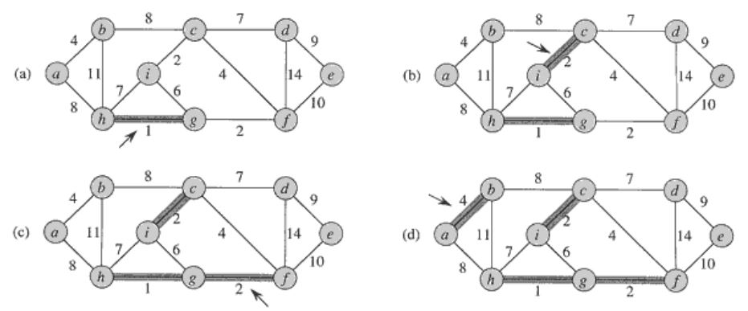
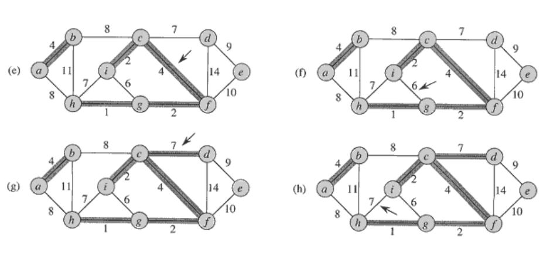
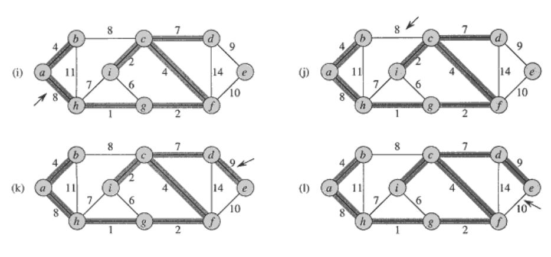
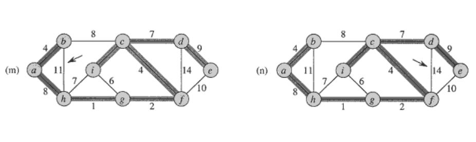
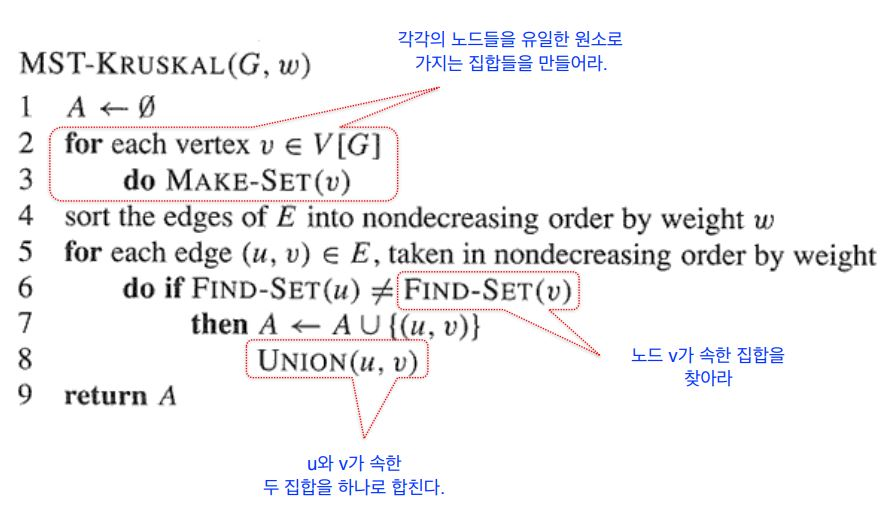

# Kruskal Algorithm

## Kruskal Algorithm

크루스칼 알고리즘 자체는 굉장히 쉽다.

* 에지들을 가중치의 오름차순으로 정렬한다. 
* 에지들을 그 순서대로 하나씩 선택해간다. 단, 이미 선택된 에지들과 사이클 \(cycle\)을 형성하면 선택하지 않는다. 
* n-1개의 에지가 선택되면 종료한다.

### 동작 원리

### 왜 MST가 찾아지는가?

A를 현재까지 알고리즘이 선택한 엣지들이라고 하고, A를 포함하는 MST가 존재한다고 가정하자.

A가 공집합에서 시작했으므로 임의의 스텝에서 A를 포함하는 MST가 존재할 때, 

크루스칼 알고리즘이 선택한 엣지가 이 A에 대해서 안전하다라는 것을 보이게 되면 증명이 되는 것이다. 

그렇게 만들어지는 엣지를 추가한 A도 MST의 일부이고 일관성이 유지되기 때문이다.

### 알고리즘

### 구현하기 쉽지 않은 이유

교수님이 Union-Find 때문에 구현이 쉽지 않다고 했을 때 왜지 싶었는데   
교수님의 Union-Find 수업 들어보니 왜 그런지 이해가 되었다.   
내가 알고 있는 Union-Find는 극히 일부였었다..

