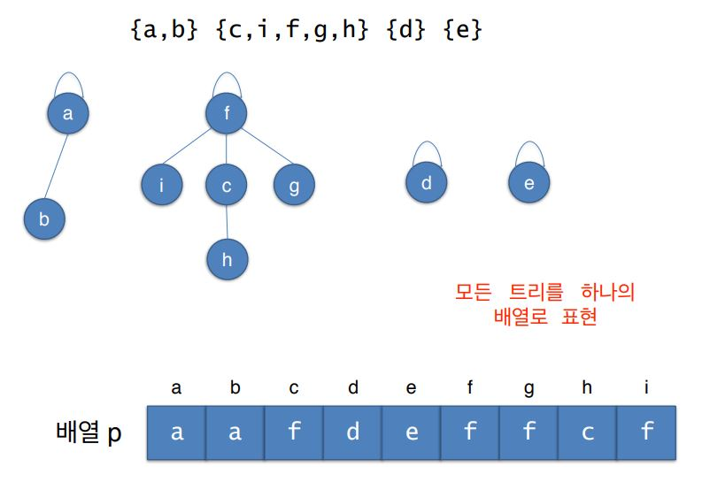
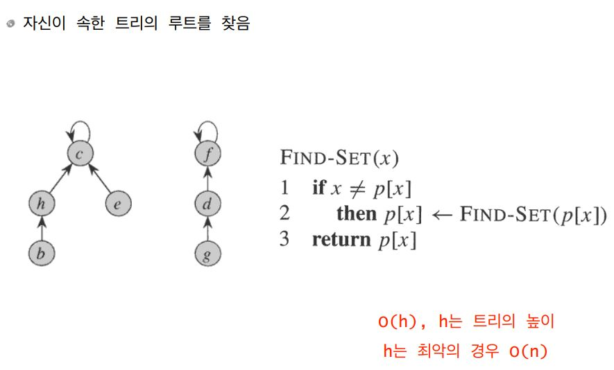
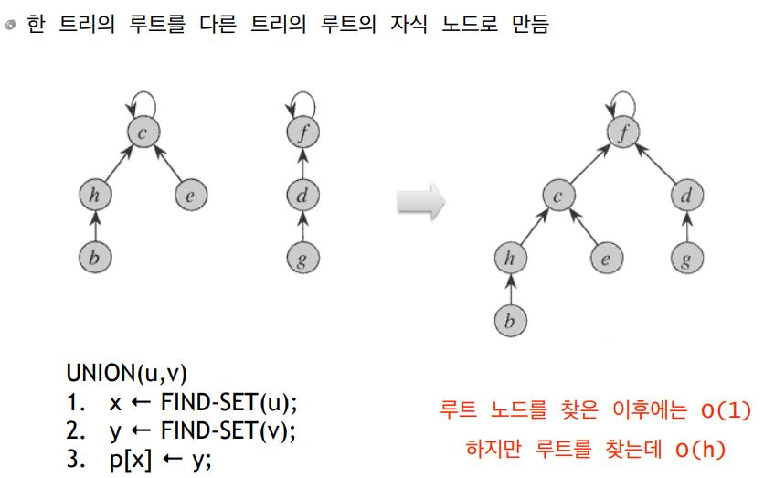
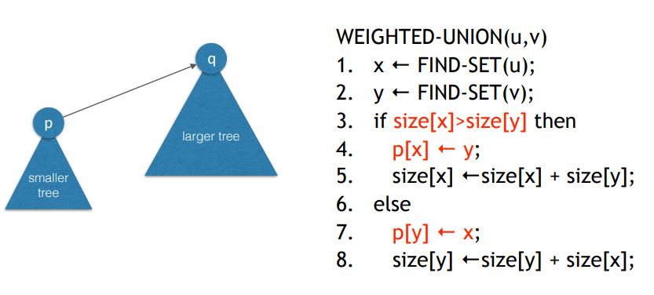
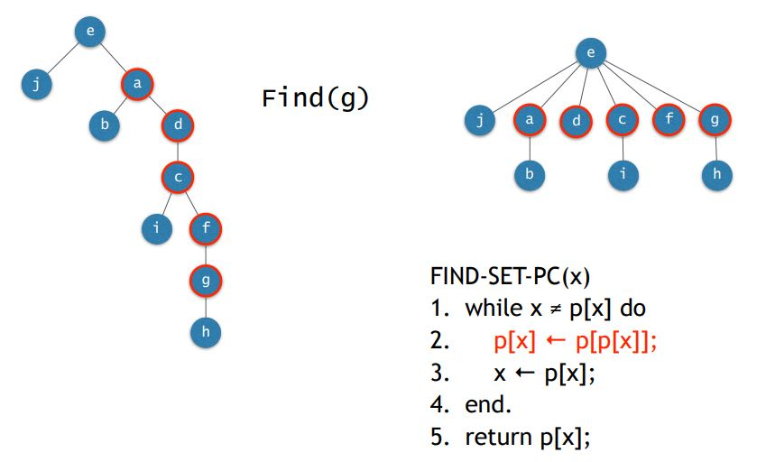

# Union Find

## 서로소인 집합들의 표현

* 각 집합을 하나의 트리로 표현
* 집합의 각 원소들이 트리의 노드가 됨. 누가 루트이고 누가 누구의 부모이든 상관없음.
* 트리의 각 노드는 자식노드가 아닌 부모 노드 의 주소를 가짐 \(상향식 트리\)
* 모든 트리를 하나의 배열로 표현

## 

## Union-Find

### Find-Set\(v\)

### Union\(u,v\)

### 

## WUPC

Weighted Union with Path Compression.

M번의 union-find 연산의 총 시간복잡도는 O\(N+Mlog\*N\). 

l~~og\*N 은 알아서 찾아보~~

여기서 N은 원소의 개수 거의 선형시간 알고리즘, 즉 한 번의 Find혹은 Union이 거의 O\(1\).

### Weighted Union

* Union에서 해줘야할 작
* 두 집합을 union할 때 작은 트리의 루트를 큰 트리의 루트의 자식으로 만듬 \(여기서 크기란 노드의 개수\) 
* 각 트리의 크기\(노드의 개수\)를 카운트하고 있어야 
* 트리 높이를 그마나 줄일 수 있다.

### 

### Path Compression

* Find에서 해줘야할 작업

