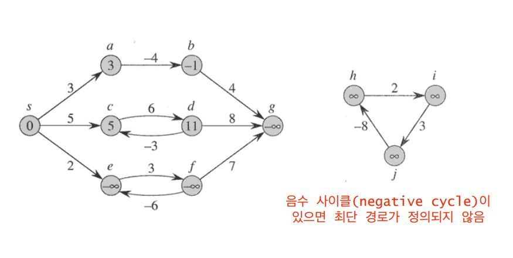
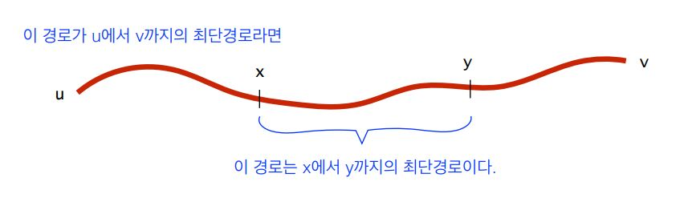
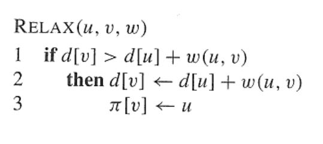
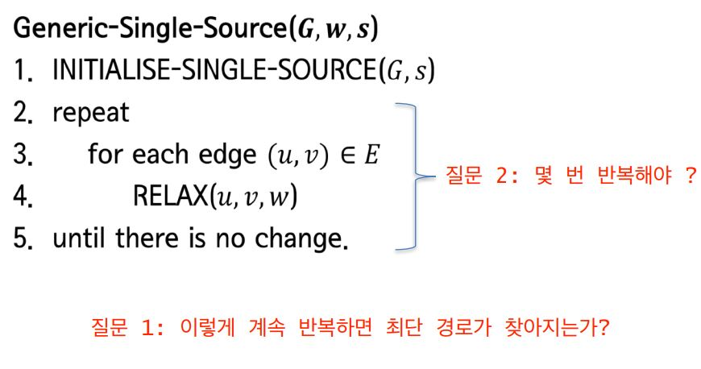
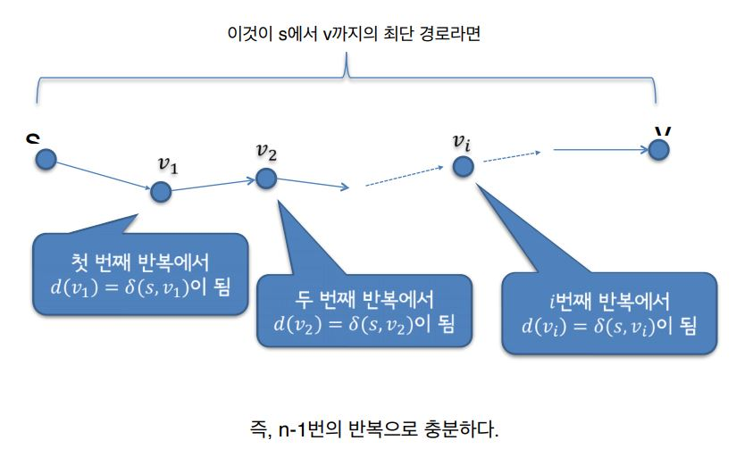

# Shortest Path

가중치 \(방향\) 그래프 G=\(V,E\), 즉 모든 에지에 가중치가 있을 때 

경로 p=\(V0,V1,...,Vk\)의 길이는 경로상의 모든 에지의 가중치의 합이다. 

노드 u에서 v까지의 최단경로의 길이를 δ\(u,v\) 라고 표시하자.

## 최단경로문제의 유형

* Single-source \(One to All\) - 하나의 출발 노드 s로부터 다른 모든 노드까지의 최단 경로를 찾아라. - 예: Dijkstra의 알고리즘 
* Single-destination - 모든 노드로부터 하나의 목적지 노드까지의 최단 경로를 찾아라.  - 만약, 무 방향 그래프이면 이 문제의 해답은 single-source 문제와 같다.
*  Single-pair \(One to One\)  - 주어진 하나의 출발 노드 s로 부터 하나의 목적지 노드 t까지의 최단 경로를 찾아라 - 최악의 경우 시간복잡도에서 Single-source 문제보다 나은 알고리즘이 없음  - 사실상 현실적으로 가장 효율성, 실용성이 있는 문제
* All-pairs \(All to All\) - 모든 노드 쌍에 대해서 최단 경로를 찾아라.

## 최단경로와 음수 가중치

알고리즘에 따라 음수 가중치가 있어도 작동하는 경우도 있고 그렇지 않은 경우도 있음.

그러 **음수 사이클\(negative cycle\)**은, 모든 경로의 합, 길이가 음수가 나오게 된다는 것이다.

사이클이 돌면 돌수록 길이가 짧아지므로 현실적으로 말이 되지 않다.

따라서 음수 사이클이 있으면 최단 경로가 정의 되지 않는다.

## 최단경로의 기본 특성

최단 경로의 어떤 부분경로도 역시 최단 경로이다. 즉 최단 경로는 모든 최단 경로의 합이다.

또한 최단 경로는 사이클을 포함 하지 않는다.

물론 음수 사이클을 가지지 않는다는 조건 하에서 말이다.

사이클을 포함하지 않는 이유는 최단 경로로 가는데 굳이 사이클을 돌아서 갈 필요가 없기때문이다.

## Single-source 최단경로문제

* 입력: 음수 사이클이 없는 가중치 방향그래프 G=\(V,E\)와 출발 노드 s∈V 
* 목적: 각 노드 v∈V에 대해서 다음을 계산한다. 
  * d\[v\]  - 처음에는 d\[s\]=0, d\[v\]=∞로 시작한다.  - 알고리즘이 진행됨에 따라서 감소해간다. 하지만 항상 d\[v\]≥δ\(s,v\)를 유지한다 - 최종적으로는 d\[v\]=δ\(s,v\)가 된다. 
  * π\[v\]: s에서 v까지의 최단경로상에서 v의 직전 노드\(predecessor\)  - 그런 노드가 없는 경우 π\[v\]=NIL.

출발점을 포함하는 모든 노드들에 대해서 d\[v\]값을 유지한다.

이는 S로 부터 V까지가는 경로의 최단 길이에 대한 추정치의 의미이다.

처음부터 최단 거리에 대한 것을 모르기 때문에, 노드까지 가는 데이터가 많아지면서

d\[v\]는 현재까지 찾은 최소한의 경로의 길이가 되며 꾸준히 업데이트된다. 

따라서 d\[s\]=0로 시작하고, 데이터가 없는 다른 노드들에 대해서는 d\[v\] = 무한대가 된다.

그러다가 결국 d\[v\]는 최종적으로 ∂\(s, v\)가 된다.

그 다음 최단 경로 길이의 문제가 길이만을 구하는 것이 아니라 실제 경로 자체를 구해야한다.

따라서 이를 위해 π\[v\]를 표현하며, s에서 v까지 최단 경로상에서 v의 직전 노드를 의미한다.

같은 원리로 처음에는 그런 노드가 없으므로 π\[v\] = NIL이다. 

### 기본 연산: Relaxation

#### 대부분의 single-source 최단경로 알고리즘의 기본 구조 

1. 초기화: d\[s\]=0, 노드 v≠s에 대해서 d\[v\]=∞,π\[v\]=NIL.   
2. 에지들에 대한 반복적인 relaxation

실제로 대부분의 single source 알고리즘은 relax 연산을 반복적으로 수행함으로써 최단 경로를 찾는다.

알고리즘 간의 차이는 relax 연산을 어떤 엣지에 대해서, 어떤 순서로 하느냐에 따라 발생한다.

### 기본 알고리즘

우선 노드가 n개 일 때 엣지의 최대 개수는 n-1개가 된다.

왜냐하면 최단 경로는 사이클을 포함하지 않으므로 노드를 2번 지나갈수 없다.

따라서 모든 노드를 거치더라도 엣지의 개수는 n-1개가 된다.

따라서 모든 엣지들에 대해 relax를 하는 것을 한 라운드라고 할 때, 첫번째 라운드에서 d\[v1\]은 찾아진다.

왜냐하면 첫번째 라운드에서 모든 엣지들에 대해 relax를 하기 때문에, 

v1노드 까지의 최단거리는 확정된다. 

그리고 두번째 라운드에서 v2 까지의 최단 경로가 찾아지며

세번째 라운드에서는 v3 까지, i 번째 라운드에서는 d\[vi\]까지의 최단 경로가 찾아진다.

그리고 위에서 말한 엣지의 개수는 n-1개 이므로, n-1번의 반복으로 최단 경로가 찾아진다.

