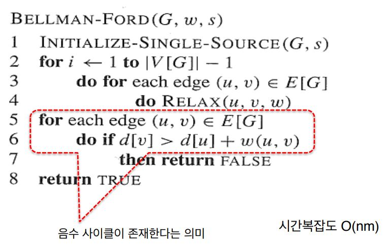
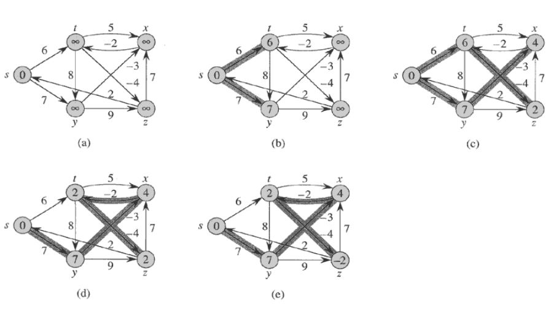
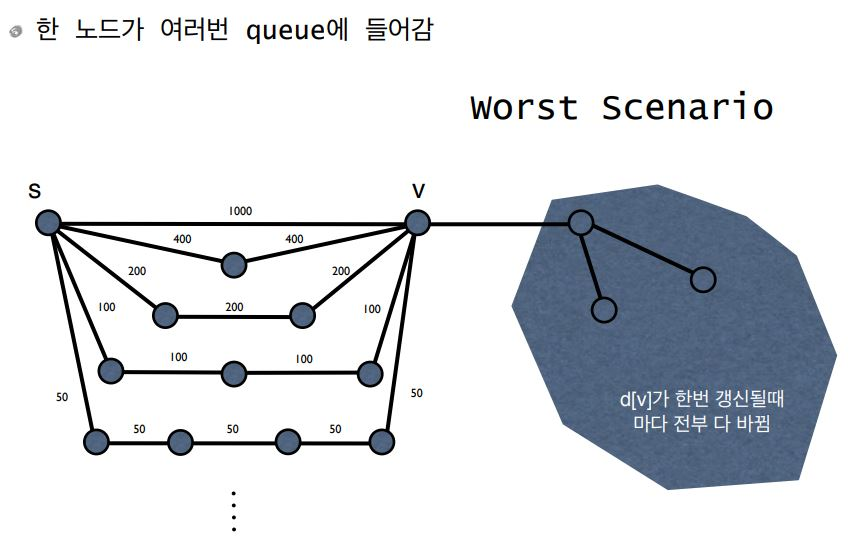

# Bellman-Ford Algorithm

## 알고리즘

일반적인 알고리즘과 다른 점은 for문의 반복이 n-1로 고정 되어 있는 것이다.

또한, Bellman-ford 알고리즘은 음수 사이클이 있는 경우에도 이를 탐지 할 수 있다.

## 동작원리

첫번째 라운드에서 모든 엣지들에 대해서 relax 한다.

relax연산이 끝나면 초기 시작점과 인접한 엣지들의 ∂값이 세팅된다.

이렇게 순차작으로 relax 연산을 실행한다.

위 그림은 한가지 실행 가능한 예이며, 어떠한 엣지를 선택하느냐에 따라서 다른 순서를 가진다.

## 최악의 경우

처음에 1000의 가중치를 가진 에지로 조져놨는데 

다음에 400,400에지를 만나서 다시 전부 조지고 이렇게 반복하면 낭비임

