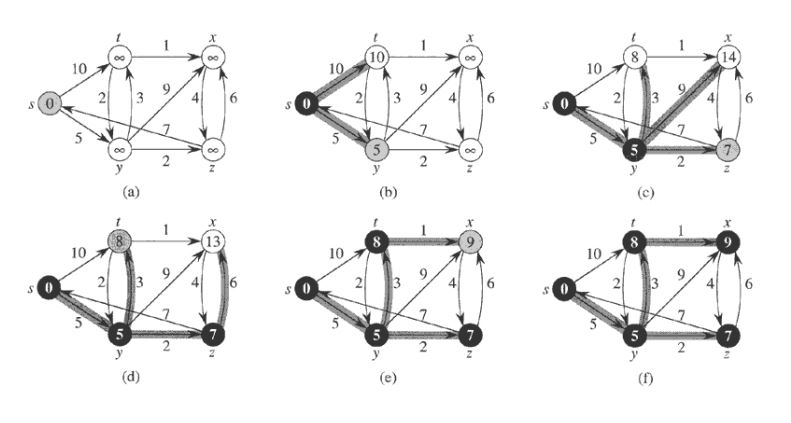
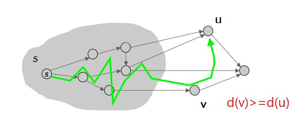
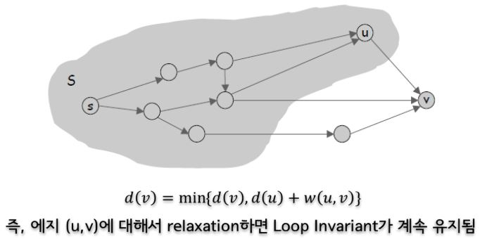
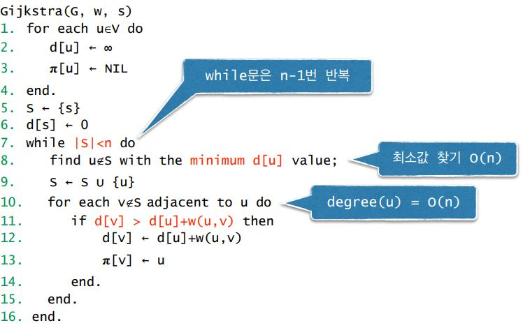
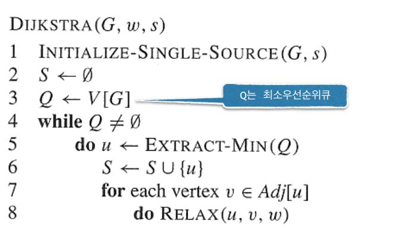

# Dijkstra Algorithm

* 음수 가중치가 없다고 가정 
* s로부터의 최단경로의 길이를 이미 알아낸 노드들의 집합 S를 유지. 맨 처음엔 S={s}.
* Loop invariant : u∉S인 각 노드 u에 대해서 d\(u\)는 이미 S에 속한 노드들만 거쳐서 s로부 터 u까지 가는 최단경로의 길이

## 동작 원리

초기화는 Bellman-ford 알고리즘과 동일하며, 엣지들에 대해 relax를 하는것도 같다.

그러나 모든 엣지들에대해 relax를 하는 것이 아니라 distance값이 최소인 값을 찾는다.

그 후, distance 값이 최소인 노드로 부터 나가는 엣지들만 relax를 실행한다.

## 정리와 증명 

* 정리: d\(u\)=minv∉S d\(v\)인 노드 u에 대해서, d\(u\)는 s에서 u 까지의 최단경로의 길이이다.
* 증명: \(proof by contradiction\) 아니라고 하자. 그러면 s에서 u까지 다른 최단경로가 존재 d\(v\)&gt;=d\(u\)이므로 모

이해못했음 ㅋㅋ;

## O\(n²\) 알고리즘

* d\(u\)가 최소인 노드 u∉S를 찾고, S에 u를 추가 
* S가 변경되었으므로 다른 노드들의 d\(v\)값을 갱신

## 우선 순위 큐를 사용한 알고리즘

프림처럼 써먹으면 됨

## 시간복잡도

* Prim의 알고리즘과 동일함
* 우선순위 큐를 사용하지 않고 단순하게 구현할 경우 O\(n²\) 
* 이진힙을 우선순위 큐로 사용할 경우 O\(nlog2n + mlog2n\) 
* Fibonacci Heap을 사용하면 O\(nlog2n+m\)에 구현가능

