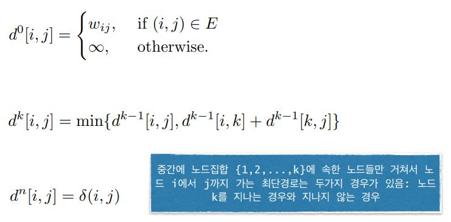
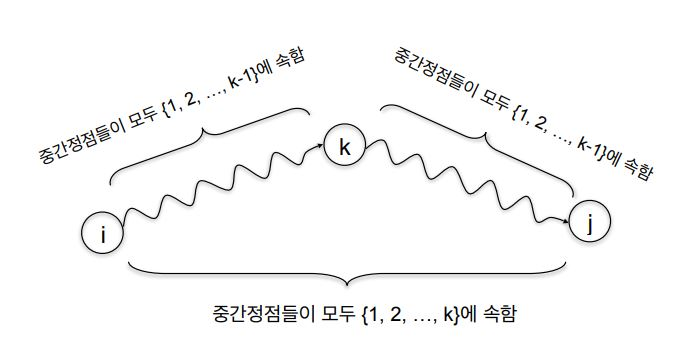
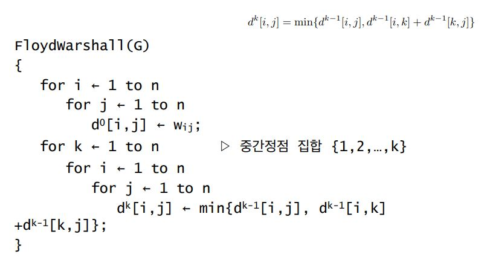
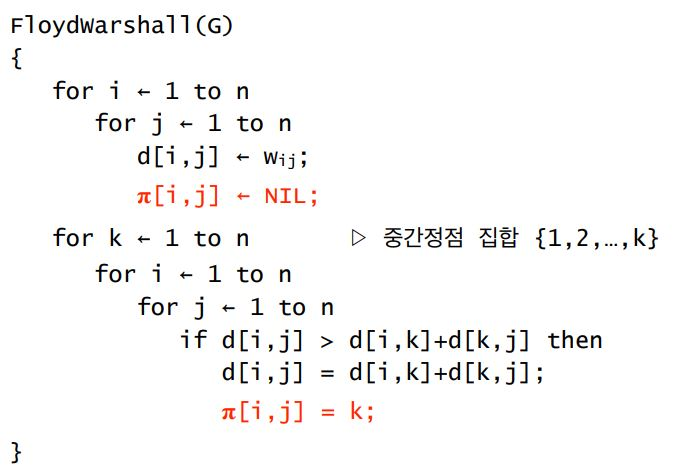
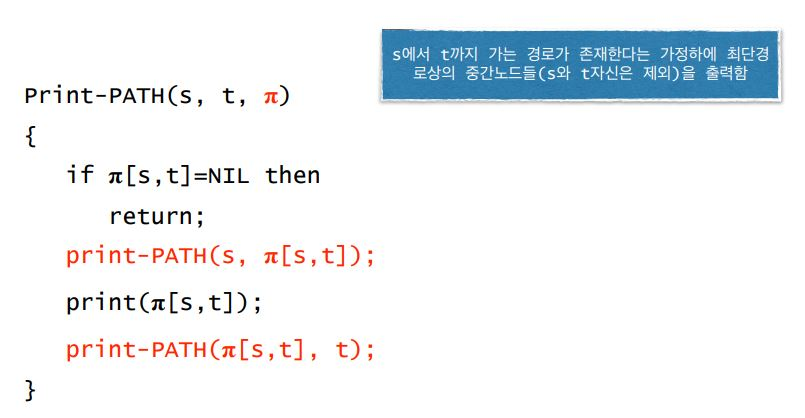

# Floyd-Warshall Algorithm

* 가중치 방향 그래프 G=\(V,E\), V={1,2,...,n}
* 모든 노드 쌍들간의 최단경로의 길이를 구함
* dᵏ\[i,j\] 중간에 노드집합 {1,2,...,k}에 속한 노드들만 거쳐서 노드 i에서 j까지 가는 최단경로의 길이

## 동작 원리 

## 알고리즘

사실 k배열까지는 필요없다. 이러면 3차원 배열이라 메모리 조진다...

조금만 생각해보면 k배열에 값을 덧씌워버려도 괜찮다는 걸 알 수 있다

## 경로 찾기

사실 뭔소린지 모름

