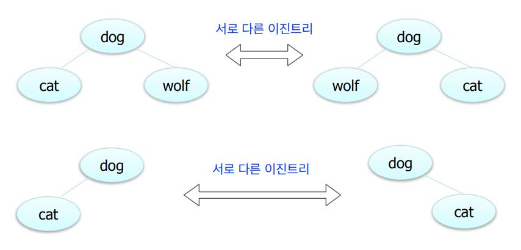
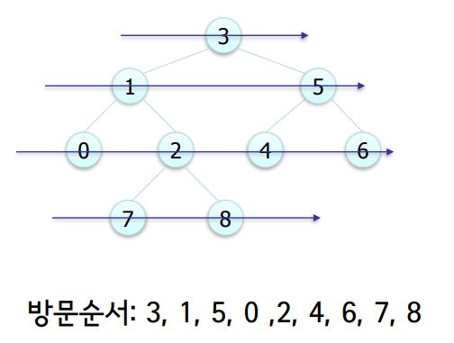

# Binary Tree

## Tree

계층적인 구조를 표현함.

* 조직도
* 디렉토리와 서브디렉토리 구조
* 가계도

노드가 N개인 트리는 항상 N-1개의 링크\(link\)를 가진다. 

트리에서 루트에서 어떤 노드로 가는 경로는 유일하다. 

또한 임의의 두 노드간의 경로도 유일하다. \(같은 노드를 두 번 이상 방문하지 않는다는 조건하에\).

## Binary Tree

이진 트리에서 각 노드는 최대 2개의 자식을 가진다. 

각각의 자식 노드는 자신이 부모의 왼쪽 자식인지 오른쪽 자신인지가 지 정된다. \(자식이 한 명인 경우에도\)



expression tree, 허프만 코드 생각해보면 된다.

## Full and Complete Binary Trees

높이가 h인 full binary tree는 2^h –1개의 노드를 가진다. 

노드가 N개인 full 혹은 complete 이진 트리의 높이는 O\(logN\)이 다. 

노드가 N개인 이진트리의 높이는 최악의 경우 N이 될수도 있다.

## 이진트리 순회

### Inorder

```text
INORDER-TREE-WALK(x)
 if x ≠ NIL
 then INORDER-TREE-WALK(left[x])
      print key[x]
      INORDER-TREE-WALK(right[x])
```

### Preorder

```text
PREORDER-TREE-WALK(x)
 if x ≠ NIL
 then print key[x]
 PRE-ORDER-TREE-WALK(left[x])
 PRE-ORDER-TREE-WALK(right[x])
```

### Postorder

```text
POSTORDER-TREE-WALK(x)
 if x ≠ NIL
 then POST-ORDER-TREE-WALK(left[x])
 POST-ORDER-TREE-WALK(right[x]).
 print key[x]
```

### Level-Order

레벨 순으로 방문, 동일 레벨에서는 왼쪽에서 오른쪽 순서로 

큐\(queue\)를 이용하여 구현



```text
LEVEL-ORDER-TREE-TRAVERSAL()
 visit the root;
 Q ← root; // Q is a queue
 while Q is not empty do
 v ← dequeue(Q);
 visit children of v;
 enqueue children of v into Q;
 end
end
```


