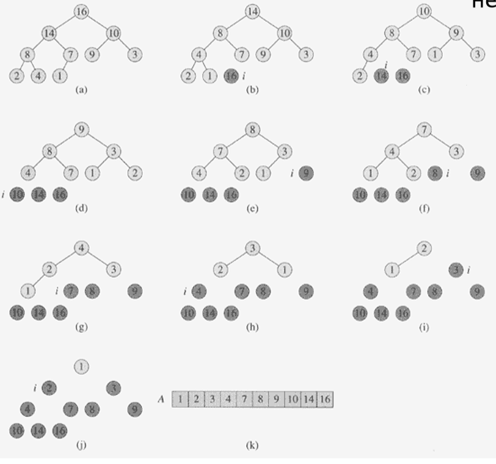

# Sort3

## Heap

* Complete Binary Tree
* Heap property

이러한 힙은 일차원 배열로 표현 가능.

### MAX-HEAPIFY


```text
MAX-HEAPIFY(A, i){   //노드 i를 루트로하는 서브트리를 heapify.
    if there is no child of A[i]
        return;
    k ← index of the biggest child of i;
    if A[i] ≥ A[k]
        return;
    exchange A[i] and A[k]; 
    MAX-HEAPIFY(A, k);
}
```

## Heap sort

1. 주어진 데이터로 힙을 만든다. 
2. 힙에서 최대값\(루트\)을 가장 마지막 값과 바꾼다. 
3. 힙의 크기가 1 줄어든 것으로 간주한다. 즉, 가장 마지막 값은 힙의 일부가 아닌 것 으로 간주한다. 
4. 루트노드에 대해서 HEAPIFY\(1\)한다.
5.  2~4번을 반복한다.

```text
HEAPSORT(A)
1.  BUILD-MAX-HEAP(A)					: O(n)
2.  for i ← heap_size downto 2 do			: n-1  times
3.	  exchange A[1] ↔ A[i]				: O(1)
4.	  heap_size ← heap_size - 1			: O(1)
5.	  MAX-HEAPFIY(A,1)					: O(log2n)
```



## 우선순위 큐

#### 최대 우선순위 큐 \(maximum priority queue\)

* INSERT\(x\): 새로운 원소 x를 삽입
* EXTRACT\_MAX\( \): 최대값을 삭제하고 반환

max heap을 이용하여 구현.

* **INSERT\(15\)**


```text
MAX-HEAP-INSERT(A, key)    {
  	heap_size = heap_size+1;
    A[heap_size] = key;
    i = heap_size;
	while ( i>1 and A[PARENT(i)] < A[i] )   {
      	exchange A[i] and A[PARENT(i)];
      	i = PARENT(i);
   }
}
```

\*\*\*\*

* **EXTRACT\_MAX\( \)**


```text
HEAP-EXTRACT-MAX(A)
if heap-size[A] < 1
    the error "heap underflow"
max <- A[1]
A[1] <- A[heap-size[A]]
heap-size[A] <- heap-size[A] - 1
MAX-HEAPIFY(A.1)
return max
```

